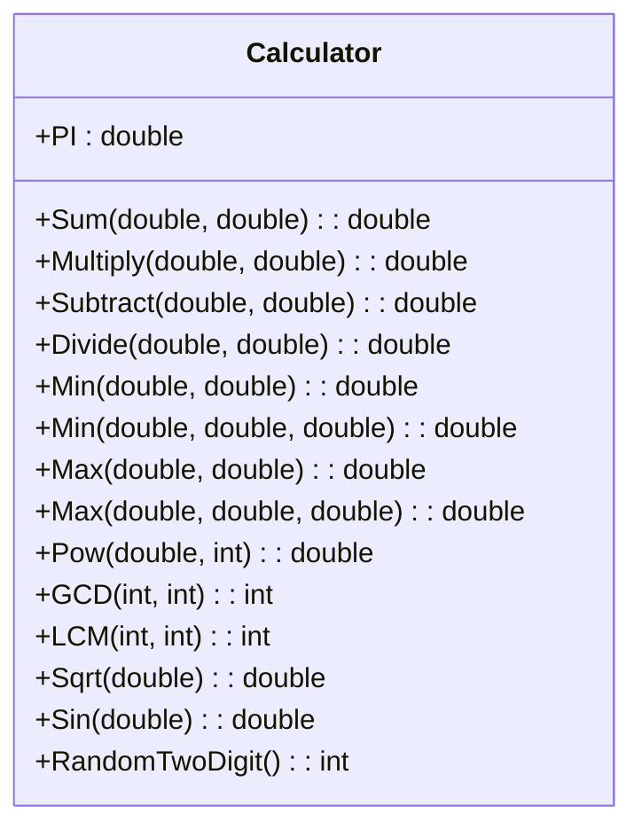

# Calculator (C#)

## Описание

Экономичный и эффективный калькулятор с минимальным интерфейсом и реализацией основных математических функций **без использования Math и сторонних библиотек** (кроме отдельных проверок для Pow/Abs, которые можно заменить).

### Возможности:

- Неизменяемое поле PI (`Calculator.PI`)
- Сумма, разность, произведение, частное двух чисел
- Минимум/максимум из 2 и 3 чисел
- Возведение в степень (целочисленная степень, поддерживает отрицательные степени)
- Наибольший общий делитель (алгоритм Евклида)
- Наименьшее общее кратное
- Квадратный корень (метод Ньютона)
- Синус (через ряд Тейлора, аргумент в радианах)
- Рандомное двузначное число (свой ГПСЧ)

## Пример использования

```csharp
Calculator calc = new Calculator();
Console.WriteLine(calc.Sum(3, 5));           // 8
Console.WriteLine(calc.Pow(2, 4));           // 16
Console.WriteLine(calc.Sqrt(25));            // 5
Console.WriteLine(calc.Sin(Calculator.PI));  // ~0
Console.WriteLine(calc.RandomTwoDigit());    // 10...99
```

## Диаграмма классов



## Запуск

1. Скомпилируйте:
   ```
   csc Calculator.cs CalculatorTest.cs
   ```
2. Запустите:
   ```
   CalculatorTest.exe
   ```

---

**Принципы ООП:**  
- Экономичность: минимум памяти, только нужные переменные  
- Инкапсуляция: все вычисления внутри класса  
- Минимальный интерфейс: только нужные методы  
- Эффективность: быстрые и простые алгоритмы  